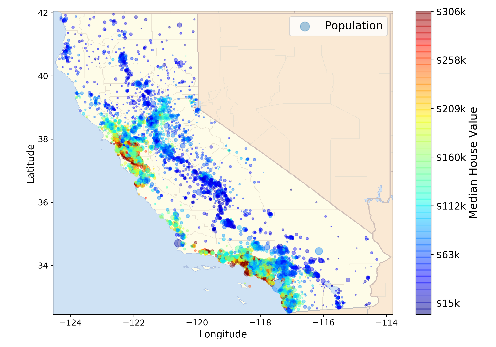

# Richie Wong's Data Science Portfolio
Repository containing portfolio of data science projects completed for academic, self learning, and professional purposes. Presented in the form of Jupyter Notebooks.

If you liked what you saw, want to have a chat with me about the portfolio, work opportunities, or collaboration, feel free to contact me on: - [LinkedIn](https://www.linkedin.com/in/richieone/)

Personal Website: http://richiewong.co.uk/

_Python Libaries: Pandas, numpy, Matplotlib, seaborn, Scikit Learn, TensorFlow, GeoPandas, Bokeh, Folium_

---

# Kaggle Kernels

 

 **[Exploratory Data Analysis Customers Profile](https://www.kaggle.com/richieone13/1-churn-notebook-eda)**

**[Predicting Customer Churn based on profile](https://www.kaggle.com/richieone13/2-churn-notebook-prediction)**

Predicting customer churn and experimenting to find the best model using Logisitic Regression, SVM, Random Forest and XGBoost. Analysis and discussion to find the best model and parameter tuning. 

 

 **[Airbnb New York EDA and Predictive Modelling](https://www.kaggle.com/richieone13/airbnb-new-york-eda-and-predictive-modelling)**

Opportunity to work on complete ready dataset (~49,000 listings) and finding interesting trends - incl. finding the market value of the rent for appartment + shared room between the different boroughs within New York. Exploring different libaries: GeoPandas, Bokeh, Folium

 
 

 **[Exploratory Data Analysis 🏀 College Basketball](https://www.kaggle.com/richieone13/exploratory-data-analysis-eda)**

Exploratory Data Analysis in USA College Basketball (2015-2019) dataset. From a young age my passion is playing and watching basketball. The motivation is to learn the history of college basketball and what is the formula for success within a team.

 
 

 **[EDA + Feature Engineering - Golden Globe Awards](https://www.kaggle.com/richieone13/eda-feature-engineering-golden-globe-awards)**

Being a fan of movies myself, I wanted to learn more about the Golden Globe awards and trends. Here I focus on feature engineering to be able to gather more meaningful insight of the different types of awards and succesful movies, directors and actors/actresses.

---

# Classification problems

### [House Price Prediction:](https://github.com/Richieone13/house-price-prediction) 
* Exploratory Data Analysis and creating visualisation of the Califorina Housing Market
* Comparison of performance in different ML models, incl. Linear Regression Model, SVR, DecisionTree and RandomForest
* Undertaking: Data Cleaning, One-Hot Encoding, CrossValidation, GridSearch, RandomizeGridSearch
* *Size of Dataset: 20,640 entries with set of 10 features*

### [Predicting if a Loan Application is Successful:](https://github.com/Richieone13/loan-prediction)
* Classification problem to predict whether the applicant will be eligible for a loan
* Exploratory Data Analysis and creating visualisation of the dataset
* 80% accuracy to predict whether the applicant is eligable for a loan using Logisitic Regression-CrossValidation
* *Size of Dataset: 614 entries with set of 13 features*

### [Prediciting if the user likes these songs:](https://github.com/Richieone13/spotify-classifier) 
* Classification problem to predict whether the likes or dislikes a song
* Exploratory Data Analysis and creating visualisation for songs in Spotify
* 72% accuracy to predict whether the person likes or dislikes a song using Decision Tree Model
* *Size of Dataset: 2,017 entries with set of 17 features*

---
# Reporting and Data Discovery

### [London Airbnb Power BI Report:](https://app.powerbi.com/view?r=eyJrIjoiNDJmNjM0ODAtZGExOC00OTk2LWFhNGItMjA1YjMyNzg4ZjJiIiwidCI6IjA3OGU4ZTc5LTE3YTctNGJkOS05MmMyLWRkZDQ1YWU4NmJkZCJ9&pageName=ReportSectiona1d10cfd8e4aa0cde1ec)
* Reporting on current listings avaiable in London as of August 2020.
* Use of visualisation software Power BI to aggregate and report on data

### [Exploring the TEDTalk Dataset:](https://github.com/Richieone13/ted-talk-discovery) 
* Exploratory Data Analysis and creating visualisation on the TedTalk Dataset from established to 2017.
* Using the panda library to answer questions about a real-world datasets - "best practices" for using pandas
* Answering interesting questions like:
  - What were the "best" events in TED history to attend?
  - Which TedTalk provoke the most online discussion?
  - Which occupations deliver the funniest TED talks on average?
* *Size of Dataset: 2,550 entries with set of 17 features*

