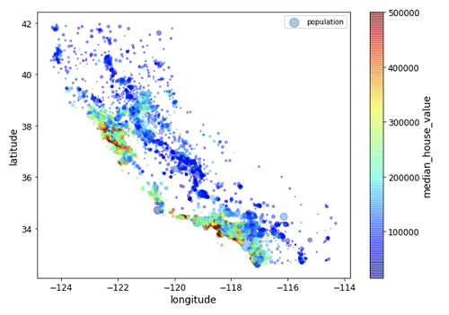

# Data Science Portfolio
Repository containing portfolio of data science projects completed for academic, self learning, and professional purposes. Presented in the form of Jupyter Notebooks.

If you liked what you saw, want to have a chat with me about the portfolio, work opportunities, or collaboration, feel free to contact me on: - [LinkedIn](https://www.linkedin.com/in/richieone/)

Personal Website: http://richiewong.co.uk/

## Contents

- ### Data Analysis and Visualisation
	- [California Housing Dataset](https://github.com/Richieone13/data_science_portfolio/blob/master/California_Housing_Dataset/California_Housing_Exploration.ipynb): This is a dataset from O'Reilly textbook (Hands-On Machine Learning with Scikit-Learn & TensorFlow), on the Califorina Housing Market. I learnt different libraries using Python, i.e. importing, understanding and visualising the data. There are 20640 instances and 10 attributes in the dataset. The motivation of this exercise is to allow to explore different methodologies of making use of the dataset and finding interesting insight.
	
	- Titanic Dataset (exploring visualisation, tools, techniques)
I aim to learn different tools and techniques of doing things and looking at peers how they tackle this as this is a well known dataset.

	- Stock Market 
Applications of visualisation with graphs using financial dataset 

	- Tourism Dataset (visualisation)
	
	_Tools: Pandas, numpy and Matplotlib_
	

- ### Machine Learning
	- (Working in Progress)
	- (https://www.kaggle.com/mlg-ulb/creditcardfraud.ipynb)Credit Card Fraud Detection
Business applications within Machine Learning space
	- Titanic Dataset (predicting survial of passenger)

	_Tools: scikit-learn, Pandas, Seaborn, Matplotlib_
  
- ### Micro Projects (interesting datasets Working in Progress)

	
