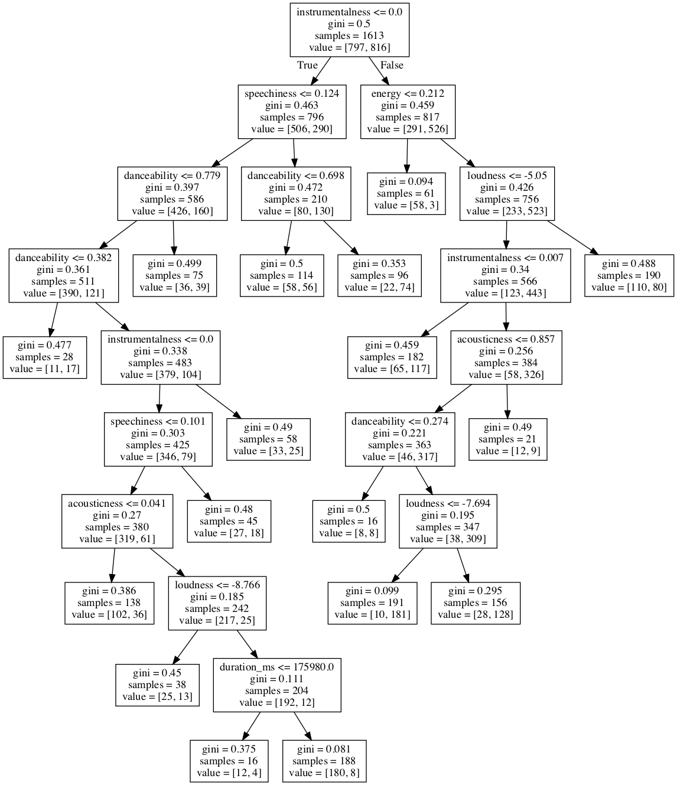

# Data Science Portfolio
Repository containing portfolio of data science projects completed for academic, self learning, and professional purposes. Presented in the form of Jupyter Notebooks.

If you liked what you saw, want to have a chat with me about the portfolio, work opportunities, or collaboration, feel free to contact me on: - [LinkedIn](https://www.linkedin.com/in/richieone/)

Personal Website: http://richiewong.co.uk/

_Tools: Pandas, numpy, Matplotlib, seaborn, Scikit Learn_

## Projects:

### [Predicting House Prices:](https://github.com/Richieone13/data_science_portfolio/blob/master/California_Housing_Dataset/California_Housing.ipynb) 
* End to end machine learning project - Predicting Califorina Housing Market
* Comparison of performance in different ML models, incl. Linear Regression Model, SVR, DecisionTree, RandomForest
* Undertaking: Data Cleaning, One-Hot Encoding, CrossValidation, GridSearch, RandomizeGridSearch

---

### [Spotify User Playlist:](https://github.com/Richieone13/data_science_portfolio/blob/master/Spotify_Classifier/Spotify_EDA_DecisionTree.ipynb) 
* Exploratory Data Analysis for songs in Spotify
* 72% accuracy to predict whether the person likes or dislikes a song using Decision Tree

---
### [TEDTalk Insights:](https://github.com/Richieone13/data_science_portfolio/blob/master/TedTalk/TedTalk_EDA.ipynb) 
* Exploratory Data Analysis on the Dataset
* Uses pandas to answer questions about a real-world datasets - "best practices" for using pandas
* Answering interesting questions like:
  - What were the "best" events in TED history to attend?
  - Which TedTalk provoke the most online discussion?
  - Which occupations deliver the funniest TED talks on average?

---

### [Loan Prediction - (WIP):](https://github.com/Richieone13/data_science_portfolio/blob/master/LoanPrediction/Loan%20Prediction%20for%20Mortgage.ipynb)
* To be able to predict whether the applicant will be eligible for a loan

---

### Upcoming Projects

* [Credit Card Fraud Detection:](https://www.kaggle.com/mlg-ulb/creditcardfraud)
* Churn Model to Retain Exisiting Customers: A subscription model or sign up model
* Stock Market Prediction: Applications of visualisation with graphs using financial dataset. Intend to directly load from Yahoo.
